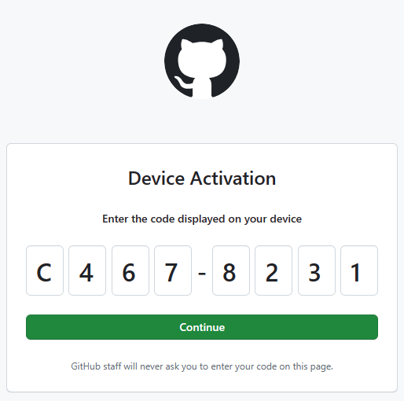
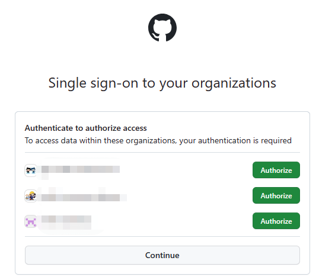
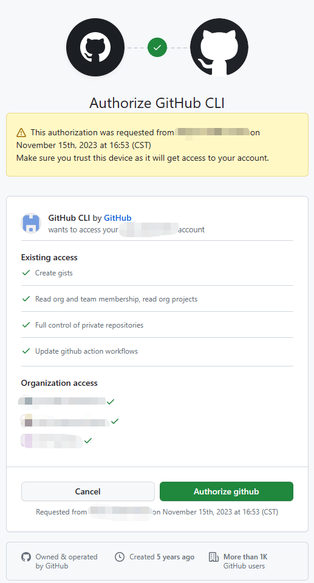

# GitHub Copilot CLI实践
最近获得了 GitHub Copilot CLI 的测试机会，这里记录一下安装配置的具体操作过程。

## 申请获得测试资格
个人用户可以在线申请。
[https://githubnext.com/projects/copilot-cli/](https://githubnext.com/projects/copilot-cli/)

## 安装配置
### Linux 操作系统下安装

1. 先安装 GitHub CLI
参考 [https://github.com/cli/cli/blob/trunk/docs/install_linux.md](https://github.com/cli/cli/blob/trunk/docs/install_linux.md)
    
```sh
type -p curl >/dev/null || (sudo apt update && sudo apt install curl -y)
curl -fsSL https://cli.github.com/packages/githubcli-archive-keyring.gpg | sudo dd of=/usr/share/keyrings/githubcli-archive-keyring.gpg \
&& sudo chmod go+r /usr/share/keyrings/githubcli-archive-keyring.gpg \
&& echo "deb [arch=$(dpkg --print-architecture) signed-by=/usr/share/keyrings/githubcli-archive-keyring.gpg] https://cli.github.com/packages stable main" | sudo tee /etc/apt/sources.list.d/github-cli.list > /dev/null \
&& sudo apt update \
&& sudo apt install gh -y
```
安装好后，检查版本
```sh
gh version
```
返回
```sh
gh version 2.39.1 (2023-11-14)
https://github.com/cli/cli/releases/tag/v2.39.1
```
表示 GitHub CLI 安装成功。

2. 在 GitHub CLI 中登录

注意先打开浏览器，访问 [https://github.com](https://github.com)，用获得了Copilot for CLI 的权限的用户先登录好。

然后执行以下命令：

```sh
gh auth login
```
按提示，选择 GitHub.com、HTTPS 模式、使用GitHub用户名和密码登录，以及使用浏览器打开授权页面。
如果是远程访问的 Linux，可能不能打开本地的浏览器，可以手工打开浏览器，访问 https://github.com/login/device 。


按上述提示输入 code，点击 Continue 按钮。

然后跳转到授权页面，点击有权限的用户所属的组织右边的 Authorize 按钮。



然后会跳转到企业员工统一登录，登录成功后再回到授权页，点击 Authorize github 按钮。



登录成功后，命令行返回
```sh
✓ Authentication complete.
- gh config set -h github.com git_protocol https
✓ Configured git protocol
! Authentication credentials saved in plain text
✓ Logged in as github_username
```

3. 安装 Copilot CLI 扩展

```sh
gh extension install github/gh-copilot
```

## 使用
完成上述安装后，已经可以使用 Copilot for CLI 了。常见的用法是输入自然语言建议出命令，以及解释一个命令的功能。目前实测，输入自然语言建议出命令的功能可以支持中文，而解释命令的功能只能返回英文。

### 输入自然语言建议出命令

```sh
gh copilot suggest "查找运行中的进程，哪个进程使用了 8080 端口"
Welcome to GitHub Copilot in the CLI!
version 0.5.3-beta (2023-11-09)

I'm powered by AI, so surprises and mistakes are possible. Make sure to verify any generated code or suggestions, and share feedback so that we can learn and improve.

? What kind of command can I help you with?  [Use arrows to move, type to filter]
> generic shell command
  gh command
  git command
```
我想要的就是通用的 shell 命令，所以保持选择第一个直接回车。然后 Copilot 就会给出建议的命令，比如：
```sh
Suggestion:

  lsof -i :8080

? Select an option  [Use arrows to move, type to filter]
> Copy command to clipboard
  Explain command
  Revise command
  Rate response
  Exit
```

### 解释命令功能

使用 gh copilot explain 再接上需要解释的命令即可，这时 Copilot 会直接返回命令的功能说明，不用再选择模式了。

```sh
gh copilot explain "dnf config-manager --add-repo https://cli.github.com/packages/rpm/gh-cli.repo"

Welcome to GitHub Copilot in the CLI!
version 0.5.3-beta (2023-11-09)

I'm powered by AI, so surprises and mistakes are possible. Make sure to verify any generated code or suggestions, and share feedback so that we can learn and improve.

Explanation:

  • dnf is the Fedora package manager.
    • config-manager is used to manage repositories.
      • --add-repo is used to add a new repository.
        • https://cli.github.com/packages/rpm/gh-cli.repo specifies the URL of the new repository.
```

## 安装快捷命令

上述直接使用 gh copilot 命令还是有点麻烦，可以安装快捷命令，这样就可以少打不少字也减少很多交互。

### 依赖 Node.js 16.0.0 或更新版本

参考 https://github.com/nodesource/distributions#ubuntu-versions

> _如果您具有root访问权限，则可以省略'sudo'命令，因为您已经具有完全的管理权限。_

1. 下载并导入 Nodesource GPG key

```sh
sudo apt-get update
sudo apt-get install -y ca-certificates curl gnupg
sudo mkdir -p /etc/apt/keyrings
curl -fsSL https://deb.nodesource.com/gpgkey/nodesource-repo.gpg.key | sudo gpg --dearmor -o /etc/apt/keyrings/nodesource.gpg
```

2. 创建deb仓库

当前最新稳定版是 20。所以

```sh
NODE_MAJOR=20
echo "deb [signed-by=/etc/apt/keyrings/nodesource.gpg] https://deb.nodesource.com/node_$NODE_MAJOR.x nodistro main" | sudo tee /etc/apt/sources.list.d/nodesource.list
```

3. 再运行 Update and Install

```sh
sudo apt-get update
sudo apt-get install nodejs -y
```
4. 安装成功后，检查版本

```sh
$ node -v
v20.9.0
$ npm -v
10.1.0
```
表示 nodejs 20.9.0 安装成功。

5. 安装 Copilot CLI

参考 https://www.npmjs.com/package/@githubnext/github-copilot-cli

```sh
sudo npm install -g @githubnext/github-copilot-cli
```

安装成功后还返回一个提示，建议升级 npm

```sh
npm notice
npm notice New minor version of npm available! 10.1.0 -> 10.2.3
npm notice Changelog: https://github.com/npm/cli/releases/tag/v10.2.3
npm notice Run npm install -g npm@10.2.3 to update!
npm notice
```
那就升级一下吧。
```sh
sudo npm install -g npm@10.2.3
```

6. 注册快捷命令

把下面这行命令加入到 ~/.bashrc 或者 ~/.zshrc 中，这样就可以直接使用快捷命令了。

```sh
eval "$(github-copilot-cli alias -- "$0")"
```
使用效果小动画


然后就可以使用 `??`、 `git?` 和 `gh?` 这 3 个快捷命令了。当然这 3 个命令都只用于输入自然语言建议出命令，不支持解释命令功能。